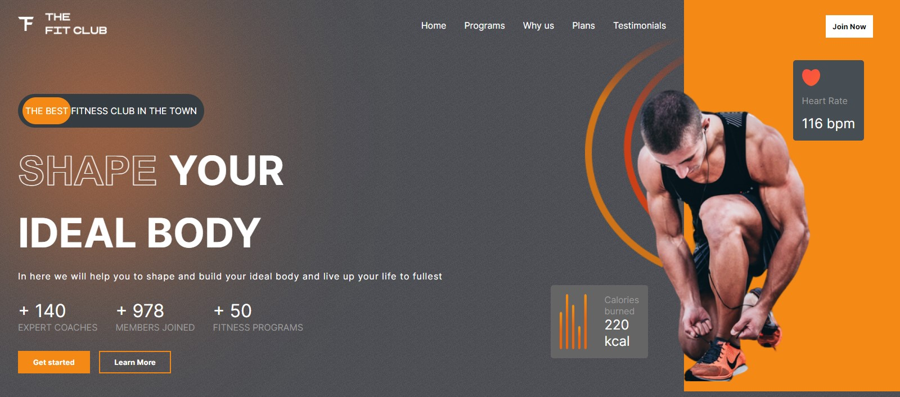

# Gym Web Application

# [Live site](https://gym-webapplication.vercel.app/)

## Available Scripts

In the project, you can run:

### `npm i` for install all dependency.

### `npm start`

Runs the app in the development mode.\
Open [http://localhost:3000](http://localhost:3000) to view it in your browser.
